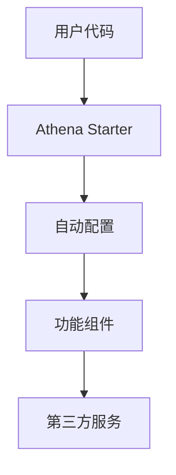

## 💡 功能描述

请清晰、简洁地描述您希望添加的功能。

## 🎯 使用场景

请描述这个功能的使用场景和业务价值：

**作为一个** [用户角色]
**我希望** [功能描述]
**以便** [达到的目标/解决的问题]

## 📍 目标模块

这个功能应该属于哪个模块（可多选）：

- [ ] athena-bom (依赖管理)
- [ ] athena-cloud (云原生支持)
- [ ] athena-common (通用工具)
- [ ] athena-sdk (第三方SDK)
- [ ] athena-starter (自动配置启动器)
- [ ] 新模块: ___________

## 🚀 功能详情

### 预期的 API 设计

请描述您期望的 API 接口设计：

```java
// 示例：期望的接口设计
@Service
public class ExampleService {

    /**
     * 功能描述
     */
    public Result<T> methodName(Parameter param) {
        // 实现逻辑
    }
}
```

### 配置参数设计

如果需要配置参数，请描述期望的配置结构：

```yaml
# application.yml
athena:
  feature-name:
    enabled: true
    property1: value1
    property2: value2
```

### 自动配置设计

如果是 starter 模块，请描述自动配置的期望：

```java
// 示例：自动配置类
@Configuration
@ConditionalOnClass(SomeClass.class)
@EnableConfigurationProperties(FeatureProperties.class)
public class FeatureAutoConfiguration {

    @Bean
    @ConditionalOnMissingBean
    public FeatureService featureService() {
        return new FeatureService();
    }
}
```

## 🔧 技术方案

### 实现方案

请描述您认为可行的实现方案：

1. **技术栈**: [如使用的框架、库等]
2. **核心组件**: [主要的类和接口]
3. **集成方式**: [如何与现有模块集成]
4. **配置方式**: [如何配置和使用]

### 架构图

如果可能，请提供简单的架构图或流程图：



## 📊 替代方案

请描述其他可能的解决方案：

1. **方案一**: [描述]
    - 优点: [优点列表]
    - 缺点: [缺点列表]

2. **方案二**: [描述]
    - 优点: [优点列表]
    - 缺点: [缺点列表]

## 🎨 用户体验

### 使用示例

请提供功能的使用示例：

```java
// 1. 添加依赖
// 在 pom.xml 中添加
<dependency>
    <groupId>io.github.gls-athena</groupId>
    <artifactId>athena-starter-xxx</artifactId>
</dependency>

// 2. 配置参数
// 在 application.yml 中配置

// 3. 使用功能
@Autowired
private FeatureService featureService;

public void useFeature() {
    Result result = featureService.doSomething();
}
```

### 文档要求

这个功能需要哪些文档：

- [ ] API 文档
- [ ] 配置说明
- [ ] 使用示例
- [ ] 最佳实践指南
- [ ] 常见问题 FAQ

## 🔗 相关资源

### 参考资料

请提供相关的参考资料：

- [ ] 官方文档: [链接]
- [ ] 技术文章: [链接]
- [ ] 开源项目: [链接]
- [ ] RFC/标准: [链接]

### 相关 Issue

如果存在相关的 Issue 或讨论，请引用：

- Related to #___
- Depends on #___
- Blocks #___

## ⚖️ 影响评估

### 兼容性影响

- [ ] 不影响现有功能
- [ ] 需要少量适配
- [ ] 可能存在破坏性变更
- [ ] 其他影响: ___________

### 性能影响

请评估对性能的潜在影响：

- [ ] 无性能影响
- [ ] 轻微性能提升
- [ ] 轻微性能影响
- [ ] 显著性能影响
- [ ] 需要性能测试

### 维护成本

请评估功能的维护成本：

- [ ] 低维护成本
- [ ] 中等维护成本
- [ ] 高维护成本
- [ ] 需要专门团队维护

## 🎯 验收标准

请定义功能完成的验收标准：

- [ ] API 设计符合项目规范
- [ ] 自动配置正常工作
- [ ] 单元测试覆盖率 > 80%
- [ ] 集成测试通过
- [ ] 性能测试达标
- [ ] 文档完整
- [ ] 示例项目可运行

## 📅 期望时间线

您希望这个功能在什么时候完成：

- [ ] 下个版本 (紧急)
- [ ] 未来 2-3 个版本 (重要)
- [ ] 长期规划 (期望)
- [ ] 无特定要求

---

**检查清单 (请确认以下事项):**

- [ ] 我已经搜索了现有的 Issue，确认这不是重复请求
- [ ] 我已经阅读了项目文档和贡献指南
- [ ] 我已经提供了清晰的功能描述和使用场景
- [ ] 我已经考虑了替代方案和影响评估
- [ ] 我愿意协助实现这个功能（如果可能）

---

感谢您的功能建议！这将帮助我们改进 Athena 项目。🚀
