# IAM系统数据库ER图

## 系统概述

雅典娜IAM系统是一个支持多租户、多系统的身份认证与访问管理平台，采用RBAC权限模型，支持单点登录、安全审计等企业级功能。

## 实体关系图

```mermaid
erDiagram
%% 租户管理模块
    sys_tenant {
        bigint id PK "租户ID"
        varchar tenant_code UK "租户编码"
        varchar tenant_name "租户名称"
        enum tenant_type "租户类型"
        enum tenant_level "租户等级"
        varchar domain UK "租户域名"
        varchar logo "租户Logo"
        varchar contact_name "联系人"
        varchar contact_phone "联系电话"
        varchar contact_email "联系邮箱"
        varchar address "联系地址"
        varchar license_key "授权密钥"
        bigint package_id FK "套餐ID"
        timestamp expire_time "到期时间"
        int max_user_count "最大用户数"
        int current_user_count "当前用户数"
        bigint storage_quota "存储配额"
        bigint used_storage "已用存储"
        enum status "状态"
        bigint create_by "创建人"
        timestamp create_time "创建时间"
        bigint update_by "更新人"
        timestamp update_time "更新时间"
        tinyint delete_flag "删除标志"
        int version "版本号"
        varchar remark "备注"
    }

    sys_tenant_package {
        bigint id PK "套餐ID"
        varchar package_code UK "套餐编码"
        varchar package_name "套餐名称"
        enum package_type "套餐类型"
        int max_user_count "最大用户数"
        bigint storage_quota "存储配额"
        int max_app_count "最大应用数"
        json feature_list "功能列表"
        decimal price_monthly "月价格"
        decimal price_yearly "年价格"
        int trial_days "试用天数"
        int sort_order "排序"
        enum status "状态"
        bigint create_by "创建人"
        timestamp create_time "创建时间"
        bigint update_by "更新人"
        timestamp update_time "更新时间"
        int version "版本号"
        varchar remark "备注"
    }

    sys_tenant_config {
        bigint id PK "配置ID"
        bigint tenant_id FK "租户ID"
        varchar config_key "配置键"
        longtext config_value "配置值"
        enum config_type "配置类型"
        tinyint is_sensitive "是否敏感"
        bigint create_by "创建人"
        timestamp create_time "创建时间"
        bigint update_by "更新人"
        timestamp update_time "更新时间"
        int version "版本号"
        varchar remark "备注"
    }

%% 应用系统模块
    sys_application {
        bigint id PK "系统ID"
        bigint tenant_id FK "租户ID"
        varchar app_code "系统编码"
        varchar app_name "系统名称"
        enum app_type "系统类型"
        varchar app_version "系统版本"
        varchar app_url "访问地址"
        varchar app_icon "系统图标"
        text app_description "系统描述"
        varchar client_id UK "客户端ID"
        varchar client_secret "客户端密钥"
        json redirect_uris "回调地址"
        varchar grant_types "授权类型"
        varchar scopes "授权范围"
        int access_token_validity "AccessToken有效期"
        int refresh_token_validity "RefreshToken有效期"
        tinyint auto_approve "是否自动授权"
        tinyint is_system "是否系统应用"
        int sort_order "排序"
        enum status "状态"
        bigint create_by "创建人"
        timestamp create_time "创建时间"
        bigint update_by "更新人"
        timestamp update_time "更新时间"
        tinyint delete_flag "删除标志"
        int version "版本号"
        varchar remark "备注"
    }

    sys_app_config {
        bigint id PK "配置ID"
        bigint tenant_id FK "租户ID"
        bigint app_id FK "系统ID"
        varchar config_key "配置键"
        longtext config_value "配置值"
        enum config_type "配置类型"
        tinyint is_sensitive "是否敏感"
        bigint create_by "创建人"
        timestamp create_time "创建时间"
        bigint update_by "更新人"
        timestamp update_time "更新时间"
        int version "版本号"
        varchar remark "备注"
    }

%% 用户管理模块
    sys_user {
        bigint id PK "用户ID"
        bigint tenant_id FK "租户ID"
        varchar username "用户名"
        varchar password "密码"
        varchar nick_name "昵称"
        varchar real_name "真实姓名"
        varchar email UK "邮箱"
        varchar phone UK "手机号"
        varchar avatar "头像"
        enum gender "性别"
        date birthday "生日"
        bigint dept_id FK "部门ID"
        tinyint is_tenant_admin "是否租户管理员"
        bigint default_app_id FK "默认系统ID"
        enum status "状态"
        tinyint account_non_expired "账户未过期"
        tinyint account_non_locked "账户未锁定"
        tinyint credentials_non_expired "凭证未过期"
        tinyint enabled "是否启用"
        int failed_login_attempts "失败登录次数"
        timestamp last_login_time "最后登录时间"
        varchar last_login_ip "最后登录IP"
        bigint last_login_app FK "最后登录系统"
        timestamp password_change_time "密码修改时间"
        bigint create_by "创建人"
        timestamp create_time "创建时间"
        bigint update_by "更新人"
        timestamp update_time "更新时间"
        tinyint delete_flag "删除标志"
        int version "版本号"
        varchar remark "备注"
    }

    sys_user_app {
        bigint id PK "ID"
        bigint tenant_id FK "租户ID"
        bigint user_id FK "用户ID"
        bigint app_id FK "系统ID"
        enum status "状态"
        timestamp expire_time "到期时间"
        bigint create_by "创建人"
        timestamp create_time "创建时间"
        bigint update_by "更新人"
        timestamp update_time "更新时间"
    }

%% 角色权限模块
    sys_role {
        bigint id PK "角色ID"
        bigint tenant_id FK "租户ID"
        bigint app_id FK "系统ID"
        varchar role_code "角色编码"
        varchar role_name "角色名称"
        int role_level "角色级别"
        enum data_scope "数据范围"
        tinyint is_system "是否系统角色"
        tinyint is_default "是否默认角色"
        enum status "状态"
        bigint create_by "创建人"
        timestamp create_time "创建时间"
        bigint update_by "更新人"
        timestamp update_time "更新时间"
        tinyint delete_flag "删除标志"
        int version "版本号"
        varchar remark "备注"
    }

    sys_permission {
        bigint id PK "权限ID"
        bigint tenant_id FK "租户ID"
        bigint app_id FK "系统ID"
        bigint parent_id FK "父权限ID"
        varchar permission_code "权限编码"
        varchar permission_name "权限名称"
        enum permission_type "权限类型"
        varchar path "路由路径"
        varchar component "组件路径"
        varchar icon "图标"
        int sort_order "排序"
        int level "层级"
        tinyint is_system "是否系统权限"
        tinyint is_external "是否外部链接"
        enum status "状态"
        tinyint visible "是否可见"
        bigint create_by "创建人"
        timestamp create_time "创建时间"
        bigint update_by "更新人"
        timestamp update_time "更新时间"
        tinyint delete_flag "删除标志"
        int version "版本号"
        varchar remark "备注"
    }

    sys_user_role {
        bigint id PK "ID"
        bigint tenant_id FK "租户ID"
        bigint app_id FK "系统ID"
        bigint user_id FK "用户ID"
        bigint role_id FK "角色ID"
        timestamp expire_time "到期时间"
        bigint create_by "创建人"
        timestamp create_time "创建时间"
    }

    sys_role_permission {
        bigint id PK "ID"
        bigint tenant_id FK "租户ID"
        bigint app_id FK "系统ID"
        bigint role_id FK "角色ID"
        bigint permission_id FK "权限ID"
        bigint create_by "创建人"
        timestamp create_time "创建时间"
    }

%% 组织架构模块
    sys_dept {
        bigint id PK "部门ID"
        bigint tenant_id FK "租户ID"
        bigint parent_id FK "父部门ID"
        varchar dept_code "部门编码"
        varchar dept_name "部门名称"
        varchar dept_path "部门路径"
        int dept_level "部门层级"
        varchar leader "负责人"
        varchar phone "联系电话"
        varchar email "邮箱"
        int sort_order "排序"
        enum status "状态"
        bigint create_by "创建人"
        timestamp create_time "创建时间"
        bigint update_by "更新人"
        timestamp update_time "更新时间"
        tinyint delete_flag "删除标志"
        int version "版本号"
        varchar remark "备注"
    }

    sys_post {
        bigint id PK "岗位ID"
        bigint tenant_id FK "租户ID"
        varchar post_code "岗位编码"
        varchar post_name "岗位名称"
        int post_level "岗位级别"
        int sort_order "排序"
        enum status "状态"
        bigint create_by "创建人"
        timestamp create_time "创建时间"
        bigint update_by "更新人"
        timestamp update_time "更新时间"
        tinyint delete_flag "删除标志"
        int version "版本号"
        varchar remark "备注"
    }

    sys_user_post {
        bigint id PK "ID"
        bigint tenant_id FK "租户ID"
        bigint user_id FK "用户ID"
        bigint post_id FK "岗位ID"
        tinyint is_primary "是否主岗位"
        bigint create_by "创建人"
        timestamp create_time "创建时间"
    }

%% 系统配置模块
    sys_dict_type {
        bigint id PK "字典类型ID"
        bigint tenant_id FK "租户ID"
        varchar dict_type "字典类型"
        varchar dict_name "字典名称"
        tinyint is_system "是否系统字典"
        enum status "状态"
        bigint create_by "创建人"
        timestamp create_time "创建时间"
        bigint update_by "更新人"
        timestamp update_time "更新时间"
        tinyint delete_flag "删除标志"
        int version "版本号"
        varchar remark "备注"
    }

    sys_dict_data {
        bigint id PK "字典数据ID"
        bigint tenant_id FK "租户ID"
        varchar dict_type "字典类型"
        varchar dict_label "字典标签"
        varchar dict_value "字典键值"
        int dict_sort "字典排序"
        varchar css_class "样式属性"
        varchar list_class "表格样式"
        tinyint is_default "是否默认"
        enum status "状态"
        bigint create_by "创建人"
        timestamp create_time "创建时间"
        bigint update_by "更新人"
        timestamp update_time "更新时间"
        tinyint delete_flag "删除标志"
        int version "版本号"
        varchar remark "备注"
    }

    sys_config {
        bigint id PK "配置ID"
        bigint tenant_id FK "租户ID"
        varchar config_name "配置名称"
        varchar config_key "配置键名"
        longtext config_value "配置键值"
        enum config_type "配置类型"
        enum value_type "值类型"
        tinyint is_system "是否系统配置"
        tinyint is_sensitive "是否敏感配置"
        bigint create_by "创建人"
        timestamp create_time "创建时间"
        bigint update_by "更新人"
        timestamp update_time "更新时间"
        tinyint delete_flag "删除标志"
        int version "版本号"
        varchar remark "备注"
    }

%% 审计日志模块
    sys_login_log {
        bigint id PK "日志ID"
        bigint tenant_id FK "租户ID"
        bigint app_id FK "系统ID"
        bigint user_id FK "用户ID"
        varchar username "用户名"
        enum login_type "登录类型"
        json client_info "客户端信息"
        varchar ip_address "登录IP"
        varchar location "登录地点"
        varchar user_agent "User Agent"
        enum status "登录状态"
        varchar failure_reason "失败原因"
        varchar session_id "会话ID"
        timestamp login_time "登录时间"
        timestamp logout_time "登出时间"
    }

    sys_operation_log {
        bigint id PK "日志ID"
        bigint tenant_id FK "租户ID"
        bigint app_id FK "系统ID"
        bigint user_id FK "用户ID"
        varchar trace_id "链路追踪ID"
        varchar module "操作模块"
        varchar operation "操作名称"
        enum business_type "业务类型"
        varchar method "方法名称"
        varchar request_method "请求方式"
        varchar request_url "请求URL"
        json request_params "请求参数"
        json response_data "返回数据"
        varchar operator_name "操作人员"
        varchar dept_name "部门名称"
        varchar ip_address "操作IP"
        varchar location "操作地点"
        varchar user_agent "User Agent"
        enum status "操作状态"
        text error_message "错误消息"
        bigint cost_time "执行耗时"
        timestamp operation_time "操作时间"
    }

    sys_user_online {
        bigint id PK "ID"
        varchar session_id UK "会话编号"
        bigint tenant_id FK "租户ID"
        bigint app_id FK "系统ID"
        bigint user_id FK "用户ID"
        varchar username "登录账号"
        varchar dept_name "部门名称"
        json client_info "客户端信息"
        varchar ip_address "登录IP"
        varchar location "登录地点"
        varchar user_agent "User Agent"
        enum status "在线状态"
        timestamp login_time "登录时间"
        timestamp last_access_time "最后访问时间"
        timestamp expire_time "过期时间"
    }

    sys_audit_log {
        bigint id PK "审计ID"
        bigint tenant_id FK "租户ID"
        bigint app_id FK "系统ID"
        bigint user_id FK "用户ID"
        varchar trace_id "链路追踪ID"
        enum event_type "事件类型"
        varchar event_name "事件名称"
        varchar resource_type "资源类型"
        varchar resource_id "资源ID"
        json old_value "变更前值"
        json new_value "变更后值"
        varchar ip_address "IP地址"
        varchar user_agent "User Agent"
        enum risk_level "风险等级"
        enum result "执行结果"
        varchar failure_reason "失败原因"
        timestamp event_time "事件时间"
    }

%% 安全管理模块
    sys_sso_ticket {
        bigint id PK "票据ID"
        varchar ticket UK "票据值"
        bigint tenant_id FK "租户ID"
        bigint user_id FK "用户ID"
        bigint source_app_id FK "源系统ID"
        bigint target_app_id FK "目标系统ID"
        enum ticket_type "票据类型"
        int used_count "使用次数"
        int max_use_count "最大使用次数"
        timestamp create_time "创建时间"
        timestamp expire_time "过期时间"
        timestamp used_time "使用时间"
        varchar ip_address "IP地址"
        varchar user_agent "User Agent"
    }

    sys_security_policy {
        bigint id PK "策略ID"
        bigint tenant_id FK "租户ID"
        varchar policy_name "策略名称"
        enum policy_type "策略类型"
        json policy_config "策略配置"
        tinyint is_enabled "是否启用"
        int priority "优先级"
        bigint create_by "创建人"
        timestamp create_time "创建时间"
        bigint update_by "更新人"
        timestamp update_time "更新时间"
        int version "版本号"
        varchar remark "备注"
    }

%% 关系定义
    sys_tenant ||--o{ sys_tenant_config: "包含"
    sys_tenant_package ||--o{ sys_tenant: "使用"
    sys_tenant ||--o{ sys_application: "拥有"
    sys_tenant ||--o{ sys_user: "拥有"
    sys_tenant ||--o{ sys_dept: "拥有"
    sys_tenant ||--o{ sys_post: "拥有"
    sys_tenant ||--o{ sys_role: "拥有"
    sys_tenant ||--o{ sys_permission: "拥有"
    sys_application ||--o{ sys_app_config: "配置"
    sys_application ||--o{ sys_user_app: "用户授权"
    sys_application ||--o{ sys_role: "角色"
    sys_application ||--o{ sys_permission: "权限"
    sys_application ||--o{ sys_login_log: "登录日志"
    sys_application ||--o{ sys_operation_log: "操作日志"
    sys_application ||--o{ sys_user_online: "在线用户"
    sys_application ||--o{ sys_sso_ticket: "SSO票据"
    sys_user ||--o{ sys_user_app: "系统授权"
    sys_user ||--o{ sys_user_role: "角色分配"
    sys_user ||--o{ sys_user_post: "岗位分配"
    sys_user }o--|| sys_dept: "所属部门"
    sys_user ||--o{ sys_login_log: "登录记录"
    sys_user ||--o{ sys_operation_log: "操作记录"
    sys_user ||--o{ sys_user_online: "在线状态"
    sys_user ||--o{ sys_sso_ticket: "SSO票据"
    sys_role ||--o{ sys_user_role: "用户分配"
    sys_role ||--o{ sys_role_permission: "权限分配"
    sys_permission ||--o{ sys_role_permission: "角色分配"
    sys_permission ||--|| sys_permission: "父子关系"
    sys_dept ||--|| sys_dept: "父子关系"
    sys_post ||--o{ sys_user_post: "用户分配"
    sys_dict_type ||--o{ sys_dict_data: "包含"
```

## 关系说明

### 1. 租户管理关系

- **sys_tenant** ← **sys_tenant_package**: 租户使用套餐（多对一）
- **sys_tenant** → **sys_tenant_config**: 租户拥有配置（一对多）
- **sys_tenant** → **sys_application**: 租户拥有应用（一对多）
- **sys_tenant** → **sys_user**: 租户拥有用户（一对多）

### 2. 用户权限关系

- **sys_user** → **sys_user_role** ← **sys_role**: 用户角色多对多关系
- **sys_role** → **sys_role_permission** ← **sys_permission**: 角色权限多对多关系
- **sys_user** → **sys_user_app** ← **sys_application**: 用户系统授权多对多关系

### 3. 组织架构关系

- **sys_dept** → **sys_dept**: 部门树形结构（自关联）
- **sys_user** ← **sys_dept**: 用户所属部门（多对一）
- **sys_user** → **sys_user_post** ← **sys_post**: 用户岗位多对多关系

### 4. 权限控制关系

- **sys_permission** → **sys_permission**: 权限树形结构（自关联）
- 所有业务表通过 **tenant_id** 实现租户数据隔离
- 角色和权限通过 **app_id** 实现系统级隔离

### 5. 审计日志关系

- 所有日志表关联用户、租户、应用信息
- 支持完整的操作链路追踪

## 核心特性

1. **多租户隔离**: 通过tenant_id实现数据隔离
2. **多系统支持**: 通过app_id实现系统级权限控制
3. **RBAC权限模型**: 用户-角色-权限三层权限控制
4. **树形结构**: 部门、权限支持树形层级结构
5. **软删除**: 关键业务数据支持软删除机制
6. **乐观锁**: 通过version字段实现并发控制
7. **完整审计**: 操作、登录、审计多维度日志记录
8. **安全策略**: 可配置的安全策略和SSO支持

## 索引设计原则

1. **复合索引**: 针对多条件查询场景优化
2. **覆盖索引**: 减少回表查询提升性能
3. **分区索引**: 大表按时间或租户分区
4. **唯一约束**: 保证业务数据唯一性

这个ER图展示了一个完整的企业级多租户多系统IAM解决方案的数据架构。
